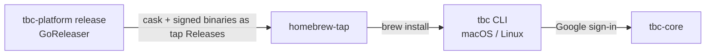

# homebrew-tap


Homebrew tap that distributes **`tbc`**, the Two Bear Capital platform CLI.

> **Public tap, private tool.** This tap has to be public so `brew install` needs no
> GitHub token, and it hosts the signed release binaries. The `tbc` source
> (`tbc-platform`) is private, and the CLI is usable only after signing in with a
> `twobearcapital.com` account — `tbc-core` is the auth boundary and rejects anyone
> else.

## Part of the Two Bear Capital platform

The distribution channel for the `tbc` CLI built in
[`tbc-platform`](https://github.com/Two-Bear-Capital/tbc-platform). Its release
process (GoReleaser) publishes the binaries and updates the cask here; users
`brew install` from this tap.



## What it does

Holds the Homebrew **cask** definition (`Casks/tbc.rb`), and hosts the released
`tbc` CLI binaries as this repo's own GitHub Releases, which the cask downloads.
No application code.

## Quick start

Requires [Homebrew](https://brew.sh) on macOS or Linux:

```sh
brew install two-bear-capital/tap/tbc
tbc auth login
brew upgrade two-bear-capital/tap/tbc   # later
```

## Documentation

- **Canonical (cross-repo, current-state):** the workspace
  [`docs/`](https://github.com/Two-Bear-Capital/tbc-platform-workspace/blob/main/docs/README.md) —
  how this tap fits is [`system-overview.md`](https://github.com/Two-Bear-Capital/tbc-platform-workspace/blob/main/docs/system-overview.md);
  the release flow is [`runbooks/release-and-deploy.md`](https://github.com/Two-Bear-Capital/tbc-platform-workspace/blob/main/docs/runbooks/release-and-deploy.md).
- [CONTRIBUTING.md](CONTRIBUTING.md) — how the cask is updated
- [CLAUDE.md](CLAUDE.md) — guidance for Claude Code
- The CLI itself: [`tbc-platform`](https://github.com/Two-Bear-Capital/tbc-platform)

## License

Internal — © Two Bear Capital. All rights reserved.
