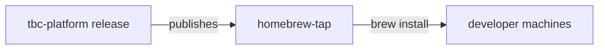

# homebrew-tap


Homebrew tap that distributes **`tbc`**, the Two Bear Capital platform CLI.

> **Internal only.** Requires a `twobearcapital.com` account; external access is
> rejected.

## Part of the Two Bear Capital platform

The distribution channel for the `tbc` CLI built in
[`tbc-platform`](https://github.com/Two-Bear-Capital/tbc-platform). Its release
process (GoReleaser) publishes the binaries and updates the formulae here; users
`brew install` from this tap.



## What it does

Holds the Homebrew formula/cask definitions (`Formula/`) pointing at released
`tbc` CLI artifacts. No application code.

## Quick start

Requires [Homebrew](https://brew.sh) on macOS:

```sh
brew install two-bear-capital/tap/tbc
tbc auth login
brew upgrade two-bear-capital/tap/tbc   # later
```

## Documentation

- [CONTRIBUTING.md](CONTRIBUTING.md) — how formulae are updated
- [CLAUDE.md](CLAUDE.md) — guidance for Claude Code
- The CLI itself: [`tbc-platform`](https://github.com/Two-Bear-Capital/tbc-platform)

## License

Internal — © Two Bear Capital. All rights reserved.
